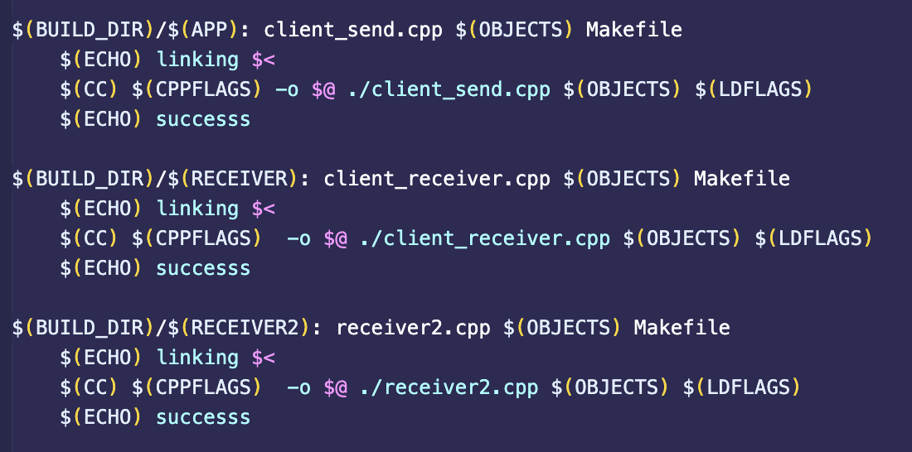
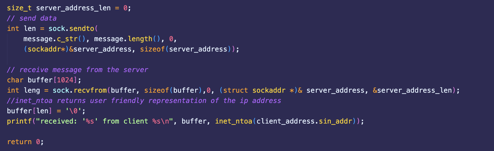
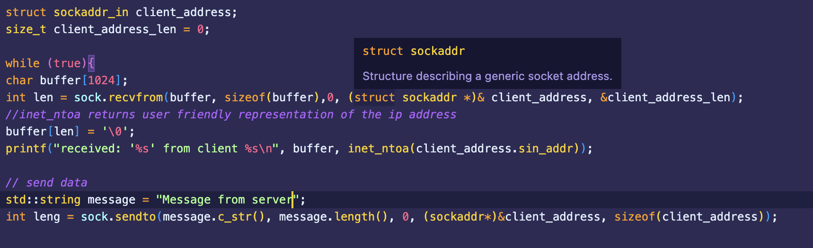
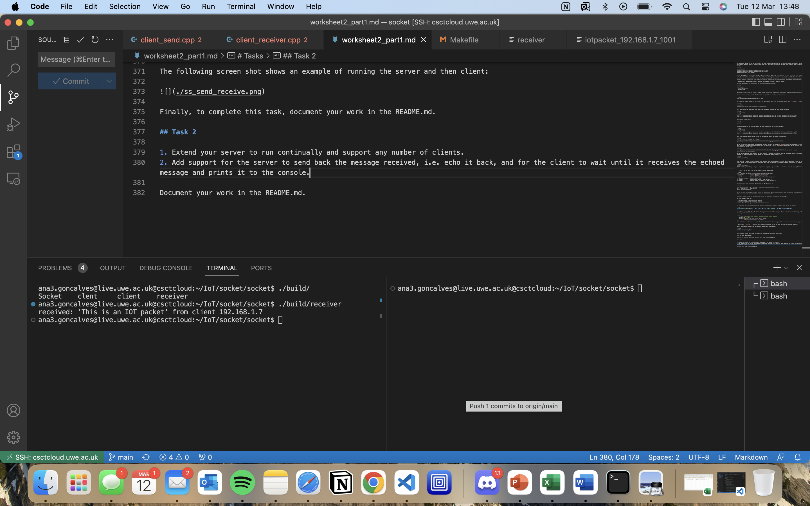
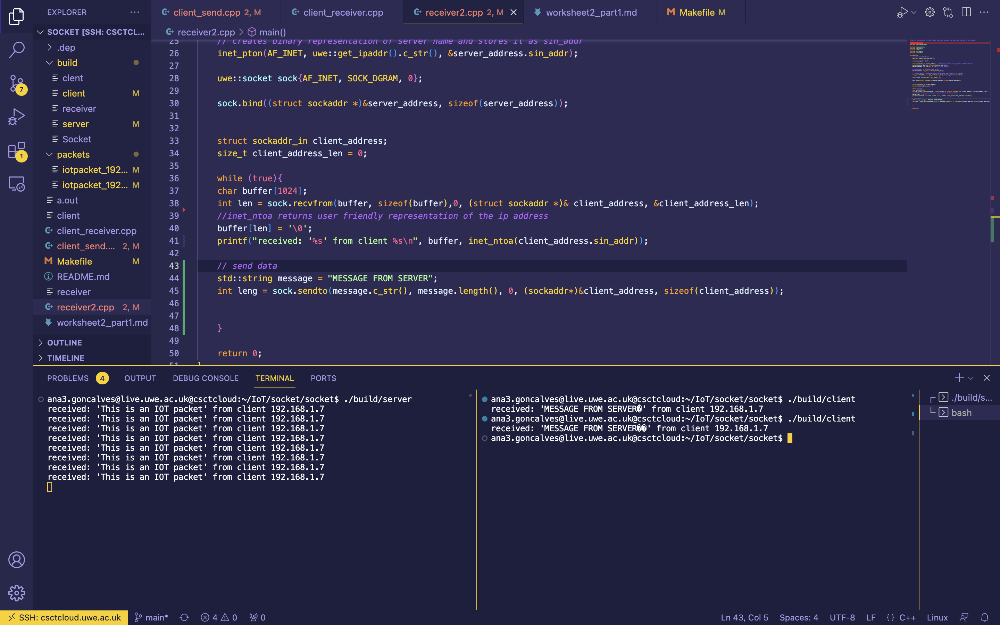

# Encrypted Socket Messenger
Author: Ana Paula Goncalves 

## Description
This project implements a socket-based communication system where a message is sent from the client to the server and is returned decrypted. The system supports multiple users and is designed to run continuously.

- The **client** sends an encrypted message.
- The **server** receives the message, decrypts it, and sends the result back.
- Task 1 and Task 2 demonstrate two versions: a basic version and an optimized one.

## Usage
To run task1 (basic version):
./build/receiver

To run Task2 (optimised version:
./build/server

In a separte terminal, run the client:
./build/client

## Structure
	•	client_send.cpp: Client-side sender (used in Task 2).
	•	client_receiver.cpp: Client-side for Task 1.
	•	receiver2.cpp: Server-side logic (possibly older version).
	•	Makefile: Automates the build process.
	•	build/: Contains compiled binaries.
	•	*.png: Diagrams/screenshots for documentation.

## Makefile

The Makefile is similar to one created in Worksheet 1. The main difference is the set of files being compiled and how they are structured. As shown below, client_send.cpp is compiled as APP and client_receiver.cpp as RECEIVER.

## Notes 
	•	The client and receiver executables are placed in the /build directory.
	•	Ensure you have the necessary permissions and that ports are not blocked.
	•	Run server first before starting client communication.

## Production  
In the Makefile i have implemented the following:
The Makefile is very similar to the makefile previously created in worksheet 1. The main differrent is the file that are being compiled and run, as shown in the image below:

In this version, the files being compiled are client_send.cpp as APP, client_receiver.cpp as RECEIVER and receiver2.cpp as RECEIVER2.

In the client_send.cpp i have made the following changes, these changes have been made to optimize the client_send file so that the client can now received the message that is echoed back to itself from the server. 

I have also implemented a 4th file (receiver2.cpp), this file is an improvement on the client_receiver file. As this file continually receives messages from the client and echo a message back to the client.

This was achieved by adding the while loop and telling it to run while true.

## Program outcome 
This is what the outcome of this program should look like. 

For task 1:

in this image we can see that the server sucessfully received the message from the client, however, the client does not continually run and the server does not send the message back to the client.

For task 2:

In this image we can see that the server is now continuously running as well as the client receiving multiple messages from the client. we are also able to see on the client side (right) that the server is also echoing a message back.

## Project status
completed 
